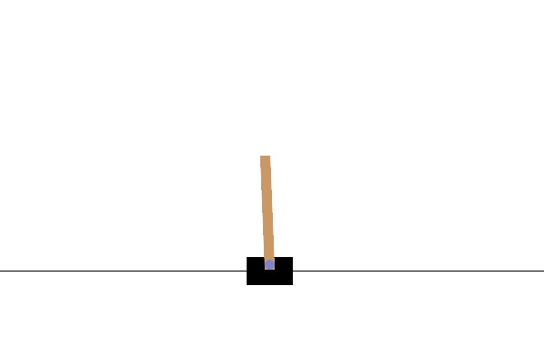
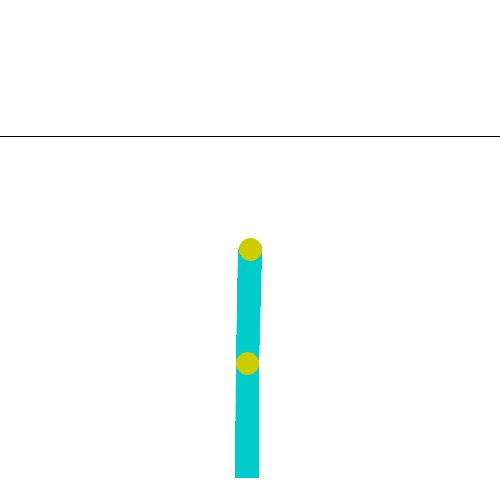
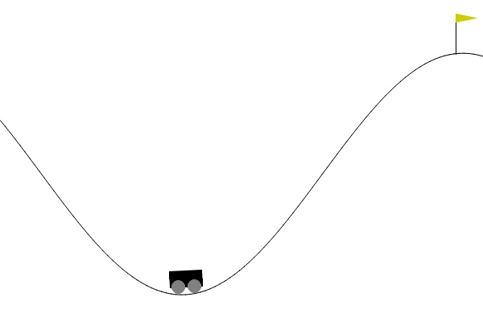

# Project Overview

This is the first part of my project, which will be about Generalization of RL.<br>
In this part, I trained agents on each of the Gymnasium's Classic Control environments

## Algorithm Configurations & Demonstrations

Configurations for each agent per gymnasium Classic Control environmnet
### CartPole-v1
#### Demonstration:
<p align="center">
  <a href="https://youtu.be/kbSs7d2yR9U" title="Click to watch the video">
    
  </a>
    <br>
  <em>Click on the image to play the demo
</p>

```
PPOConfig().framework("torch")
           .training(model={"fcnet_hiddens": [256, 256]}, lr=0.0003, kl_coeff=0.3,
                      clip_param=0.2, lambda=0.95, gamma=0.99, train_batch_size=5000)
           .environment(env="CartPole-v1")
           .resources(num_gpus=1, num_cpus_for_local_worker=2,
                       num_gpus_per_worker=0.5, num_cpus_per_worker=2)
           .rollouts(num_rollouts_workers=2)
```

### Acrobot-v1
#### Demonstration:
<p align="center">
  <a href="https://youtu.be/0zi6yhVgr0k" title="Click to watch the video">
    
  </a>
  <br>
  <em>Click on the image to play the demo
</p>

```
PPOConfig().framework("torch")
           .training(model={"fcnet_hiddens": [256, 256]}, lr=0.0003, kl_coeff=0.3,
                      clip_param=0.2, lambda=0.95, gamma=0.99, train_batch_size=5000)
           .environment(env="Acrobot-v1")
           .resources(num_gpus=1, num_cpus_for_local_worker=2,
                       num_gpus_per_worker=0.5, num_cpus_per_worker=2)
           .rollouts(num_rollouts_workers=2)
```

### MountainCar-v0
#### Demonstration:
<p align="center">
  <a href="https://youtu.be/Qui1cPaOqlo" title="Click to watch the video">
    
  </a>
    <br>
  <em>Click on the image to play the demo
</p>

```
PPOConfig().framework("torch")
           .training(model={"fcnet_hiddens": [64]}, lr=0.0003, kl_coeff=0.3,
                      clip_param=0.2, lambda=0.95, gamma=0.99, train_batch_size=5000)
           .environment(env="MountainCar-v0")
           .resources(num_gpus=1, num_cpus_for_local_worker=1,
                       num_gpus_per_worker=0.2, num_cpus_per_worker=1)
           .rollouts(num_rollouts_workers=5)
```

### Pendulum-v1
#### Demonstration:
<p align="center">
  <a href="https://youtu.be/Y4XiNPqQNmY" title="Click to watch the video">
    
  </a>
    <br>
  <em>Click on the image to play the demo
</p>

```
SACConfig().framework("torch")
           .training(lr=0.01, gamma=0.95, train_batch_size=32)
           .environment(env="Pendulum-v1")
           .resources(num_gpus=0)
           .rollouts(num_rollouts_workers=1)
```

# Conclusion

Since I trained an agent per environment, now I'll try to come up with an algorithm to somehow Merge these Policies into a big one giant policy, 
that can do its task irrespective of the given environment, so long its one of the 4 environments.<br>
And it should also be able to control them simultaneously.<br>
